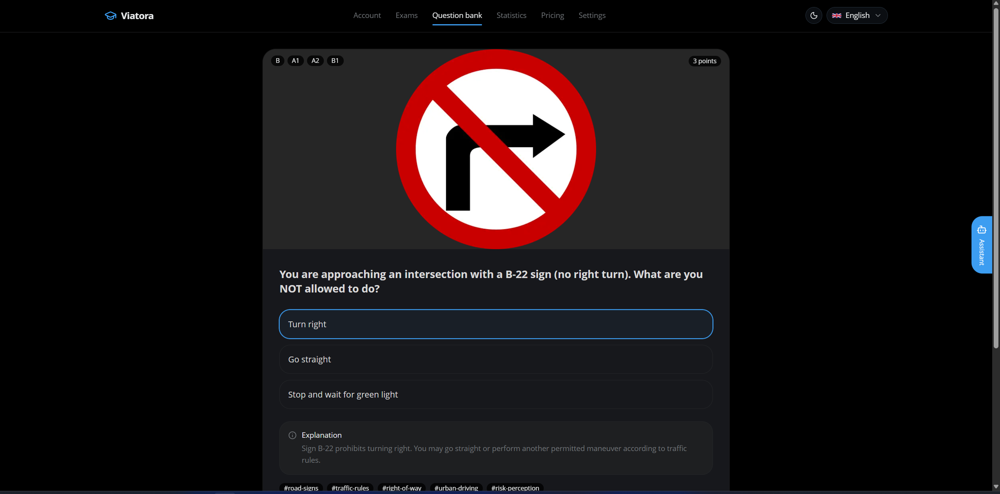
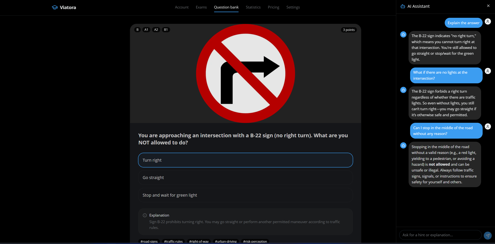

# Viatora

Viatora is a modern, multi-service platform for preparing for the driving license exam. It combines structured exam practice, subscription-based access, progress analytics, and an AI-powered learning assistant into one experience designed to help learners study more effectively.



## Why Viatora stands out

- A polished learning experience for exam preparation, not just a basic quiz app.
- Built as a real-world distributed system with separate services for auth, content, payments, analytics, and notifications.
- Designed for growth: the platform can support more exam topics, richer content, and new personalized learning flows.
- Includes an AI assistant that can explain questions, clarify concepts, and guide learners when they get stuck.

## Core product features

- Practice exams with structured question flows and score tracking.
- Personalized learning insights through analytics and progress history.
- Subscription-based access for premium content and features.
- Notifications for sign-up, payments, and exam milestones.
- Rich media content managed through a headless CMS for images, videos, and learning assets.

## AI in the project

Viatora includes a dedicated AI assistant service that uses an LLM-backed experience to support learners during study sessions. The assistant is meant to make preparation more interactive by explaining difficult questions, answering follow-up questions, and helping students understand the reasoning behind correct answers.



## Architecture at a glance

The platform is organized as a set of focused services:

- Web experience built with Next.js.
- API Gateway for routing and access control.
- Auth Service for identity, OAuth, and token handling.
- Exam Engine for exam sessions and scoring.
- Content Service for questions and media assets.
- Payment Service for subscriptions and billing.
- Statistics and Notification services for insights and communications.
- AI Assistant service for conversational guidance.

A full overview is available in [docs/architecture.md](docs/architecture.md).

## Tech stack

- Frontend: Next.js, TypeScript
- Backend services: NestJS, FastAPI, Spring Boot
- Data and messaging: PostgreSQL, Redis, Kafka, Sanity
- Infrastructure: Docker, container-based local development

## Getting started

1. Clone the repository.
2. Start the supporting infrastructure with Docker.
3. Configure environment variables for the services.
4. Launch the services you need for local development.

Example:

```bash
docker compose up -d
```

For service-specific setup and run instructions, see the individual service READMEs in the services folder.

## Documentation

- [Architecture overview](docs/architecture.md)
- [Technical rationale](docs/tech-rationale.md)
- [Service documentation](docs/services)

## Screenshots and media

Add product screenshots, dashboard visuals, and AI assistant examples here as the project evolves.


