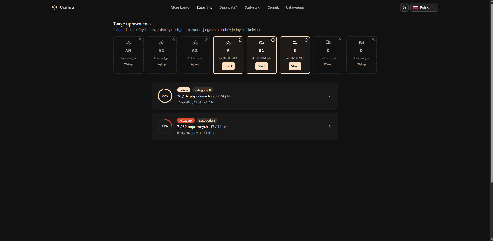
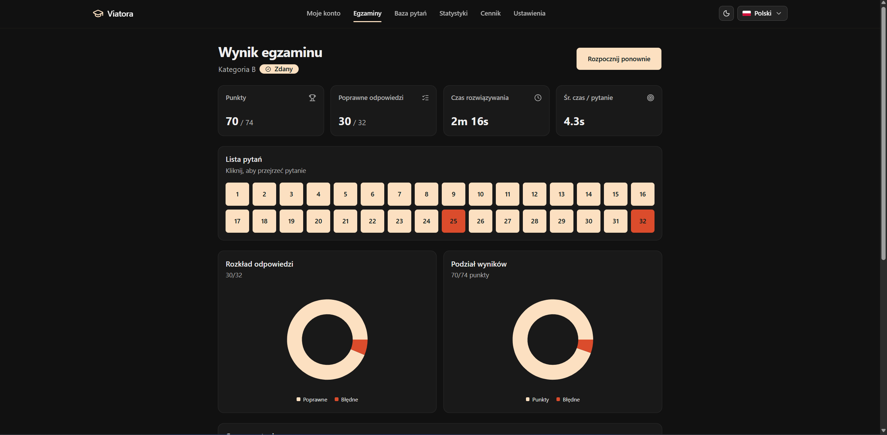
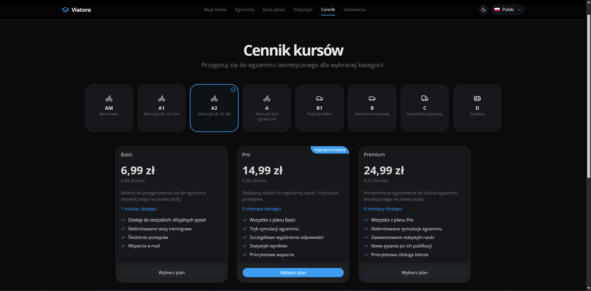
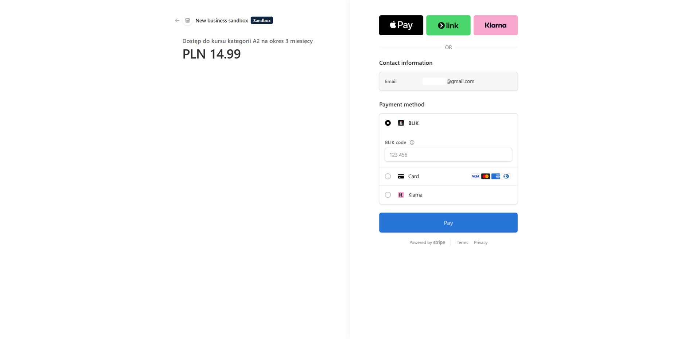

# Viatora

**Viatora** is a modern, multi-service platform for preparing for the driving license exam. It combines realistic exam practice, category-based subscriptions powered by Stripe, progress analytics, and an AI-powered learning assistant into a single, cohesive learning experience.


<p align="center">
  
  
  
  
  
</p>

---

## Why Viatora stands out

- Designed as a complete learning platform, not a simple quiz app.
- Built on a distributed microservice architecture with clearly separated domains.
- Category-based subscription access to driving license exam categories.
- Detailed analytics that help learners identify strengths and weaknesses.
- A dedicated AI assistant that explains questions and concepts on demand.
- Built with scalability in mind — new exam categories and features can be added without reworking the core.

---

## Table of contents

- [Architecture](#architecture)
- [AI Assistant](#ai-assistant)
- [User interface](#user-interface)
- [Exam library](#exam-library)
- [Exam summary & analytics](#exam-summary--analytics)
- [Subscriptions & payments](#subscriptions--payments)
- [Technology stack](#technology-stack)
- [Getting started](#getting-started)
- [Documentation](#documentation)
- [Project goals](#project-goals)

---

## Architecture


Viatora follows a distributed microservice architecture where each service owns a specific business domain:

| Service                     | Responsibility                            |
| --------------------------- | ----------------------------------------- |
| **Next.js Web Application** | User interface                            |
| **API Gateway**             | Routing, authentication and authorization |
| **Auth Service**            | User accounts, OAuth and JWT              |
| **Exam Engine**             | Exam sessions, validation and scoring     |
| **Content Service**         | Questions and multimedia assets           |
| **Payment Service**         | Stripe integration and subscriptions      |
| **Statistics Service**      | Learning analytics and progress tracking  |
| **Notification Service**    | Email notifications and events            |
| **AI Assistant Service**    | Conversational learning support           |

📄 More details: [Architecture Overview](docs/architecture.md)

---

## AI Assistant

Viatora includes a dedicated AI assistant that makes studying interactive rather than passive.

The assistant can:

- explain why an answer is correct,
- clarify difficult concepts,
- answer follow-up questions,
- guide learners through confusing topics,
- encourage understanding instead of memorization.

The AI service is implemented as an **independent microservice**, so it can be improved or replaced without affecting the rest of the platform.


---

## User interface

Viatora provides a modern, accessible user interface with full localization support for **Polish** and **English**.

The application supports multiple professionally designed color themes inspired by the palettes available at [tweakcn](https://tweakcn.com/themes):

- Caffeine
- Supabase
- Vercel
- Twitter
- Notebook
- Claude

Every theme is available in both **Light** and **Dark** mode, letting users personalize the interface while keeping a consistent experience.

> **Note on screenshots:** most screenshots in this README use the **Twitter** theme, except for the _Exam library_ and _Exam summary_ screenshots below, which use the **Caffeine** theme.

### Exam library

The exam library gives an overview of all available practice exams, letting users quickly browse content and start a learning session.



### Exam summary & analytics

After completing an exam, users receive a detailed summary including:

- overall score,
- correct and incorrect answers,
- performance statistics,
- visual charts,
- learning progress over time.

These insights help learners focus on the topics that need the most practice.



---

## Subscriptions & payments

Viatora integrates **Stripe** for secure subscription management and online payments.

Instead of unlocking the entire platform at once, learners purchase access to a specific **driving license category** (for example, Category B). Once payment completes successfully, access is granted automatically and synchronized across the platform.

The payment workflow includes:

- subscription plan selection,
- secure Stripe Checkout,
- automatic subscription activation,
- payment status synchronization,
- access control enforced by backend services.

### Subscription plans

Users can compare available plans before purchasing access.



### Secure Stripe Checkout

Payments are processed through Stripe Checkout, providing a secure and familiar payment experience.



---

## Technology stack

**Frontend**
Next.js · TypeScript · Tailwind CSS · shadcn/ui

**Backend**
NestJS · Python · Spring Boot

**Infrastructure**
Docker · Docker Compose · Kafka · Redis

**Databases & storage**
PostgreSQL · Sanity CMS

**Payments**
Stripe

---

## Getting started

1. Clone the repository:

   ```bash
   git clone <repository-url>
   ```

2. Start the infrastructure:

   ```bash
   docker compose up -d
   ```

3. Configure the required environment variables for each service.

4. Start the services you want to develop locally.

Each microservice contains its own README with service-specific setup instructions.

---

## Documentation

The project contains extensive technical documentation covering architecture, communication, security, and implementation details.

- [Documentation hub](docs/README.md)
- [Architecture overview](docs/architecture.md)
- [Communication model](docs/communication/communication.md)
- [Security guide](docs/security.md)
- [Technical rationale](docs/tech-rationale.md)
- [Service documentation](docs/services)

---

## Project goals

Viatora demonstrates the design and implementation of a modern distributed application combining:

- microservice architecture,
- secure authentication,
- subscription-based monetization,
- AI-assisted learning,
- real-time messaging,
- analytics,
- scalable content management,
- and a polished user experience.
