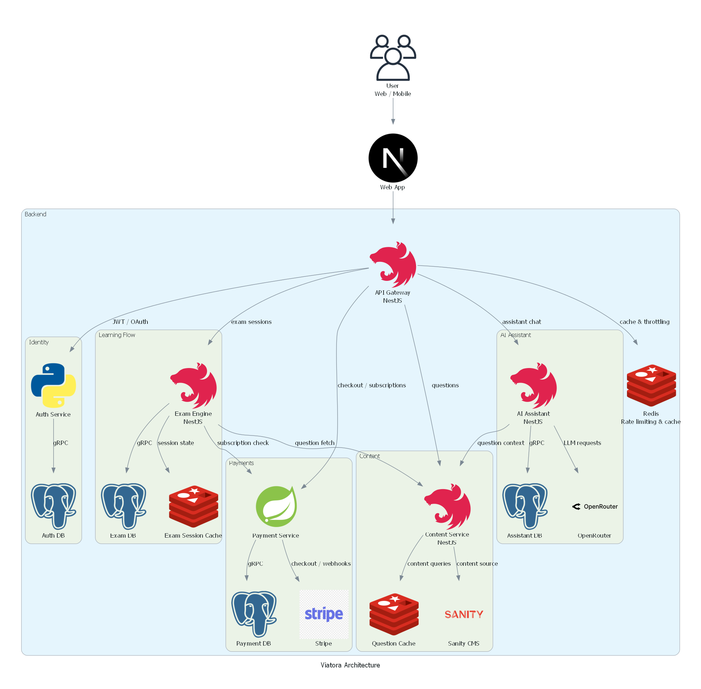

# Architecture Overview

Viatora is structured as a modular platform that separates core responsibilities into independent services. This approach makes the product easier to evolve, easier to deploy, and better suited for real-world growth than a single monolithic application.

## Product perspective

The product experience is centered on three goals:

1. Help learners prepare for the driving license exam.
2. Provide clear feedback and measurable progress.
3. Offer intelligent support through AI-assisted explanations.

## Architecture diagram

A simple high-level view of the system is:

The gateway is the single ingress point for all incoming traffic. Internal services do not expose public endpoints directly.

## Core services

### 1. Web application

The frontend experience is delivered through Next.js and provides the user-facing journey for exams, account management, progress tracking, and subscriptions.

### 2. API Gateway

The gateway acts as the single entry point for client traffic. It handles routing, access control, authentication checks, rate limiting, and request translation for the downstream services. All user-facing traffic flows through this layer.

### 3. Auth Service

This service manages identity and session security. It supports social login, token issuance, and user identity validation for the rest of the platform.

### 4. Exam Engine

The exam engine is the core learning workflow. It manages exam sessions, evaluates submissions, stores results, and publishes completed exam events.

### 5. Content Service

The content service provides exam questions, media assets, and structured learning material. It is designed to work well with rich media such as images and instructional videos.

### 6. Payment Service

This service handles subscription access and billing flows. It creates Stripe checkout sessions, processes Stripe webhooks, and persists subscription state.

### 7. Statistics Service

The statistics service turns exam outcomes into useful insights such as performance trends, weak areas, and progress over time.

### 8. Notification Service

This service handles user communications such as confirmations, reminders, and milestone updates.

### 9. AI Assistant Service

The AI assistant service adds an interactive layer on top of the learning experience. It can explain difficult questions in plain language and support learners when they need more guidance.

## Communication model

The system uses a combination of synchronous service-to-service communication and event-driven messaging:

- HTTP and gRPC are used for direct requests where low latency matters.
- Kafka is used for asynchronous events such as completed exams, payments, and account events.
- Redis supports caching and short-lived session state.
- PostgreSQL stores the persistent data for each service.
- Sanity is used as the content source for rich exam materials.
- Stripe is used for subscription and billing operations.

## Service storage responsibilities

Each service owns its own persistence boundary:

- Auth Service: user profiles, refresh tokens, identity state.
- Exam Engine: exam sessions, answers, result records.
- Content Service: question bank and media metadata, backed by Sanity and cached in Redis.
- Payment Service: orders, subscriptions, and Stripe-related billing state.
- Statistics Service: aggregated exam and learning analytics data.
- Notification Service: notification preferences and delivery logs.
- AI Assistant Service: conversation history and assistant message records.

## Why this architecture fits the project

This structure helps the team keep the platform reliable while still allowing each domain to evolve independently. It also makes it easier to introduce more AI features, richer analytics, and additional content experiences over time.

## Related documentation

- [Documentation hub](./README.md)
- [Technical rationale](./tech-rationale.md)
- [Communication summary](./communication/communication.md)
- [Security guide](./security.md)
